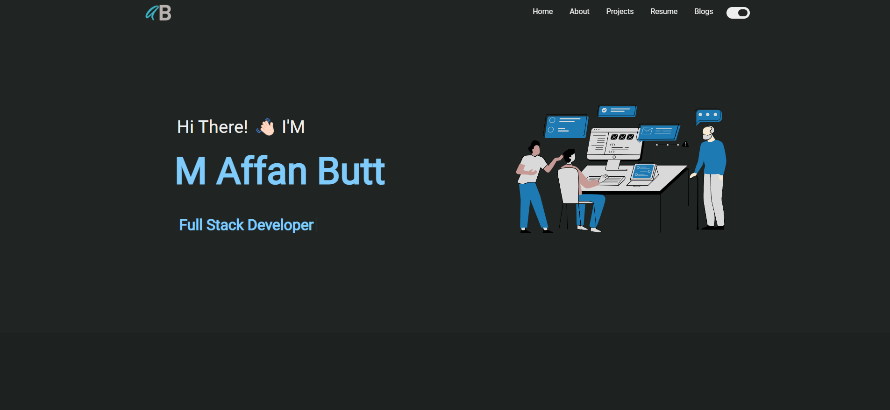

<h2 align="center">
  Rahul Jha | Portfolio Website 
  <a href="https://www.rahuljha.tech/" target="_blank">rahuljha.tech</a>
</h2>

  

 

Thanks in Advance😍!

## Built With

My personal portfolio website <a href="affans-portfolio.netlify.app" target="_blank">rahuljha.tech</a> which features some of my github projects as well as my resume and technical skills. 

This project is built using these technologies.

- React.js
- CSS3
- VsCode
- Vercel

## Features

**Multi-Page Layout**

**Styled with React-Bootstrap and Css**

**Fully Responsive**

**Dark and Light Theme**

## Getting Started

Clone this repository. You will need `node.js` and `git` installed globally on your machine.

## 🛠 Installation and Setup Instructions

1. Installation: `npm install`

2. In the project directory, you can run: `npm start`

Runs the app in the development mode.\
Open [http://localhost:3000](http://localhost:3000) to view it in the browser.
The page will reload if you make edits.

## Usage Instructions

Open the project folder and Navigate to `/src/components/`.  
You will find all the components used and you can edit your information accordingly.

### Show your support

<h3 align="center">
    🔹
    <a href="http://localhost:3000/resume">Report A Bug</a> &nbsp; &nbsp;
    🔹
    <a>Request A Feature</a>

</h3>

Give a ⭐ if you like this website!

